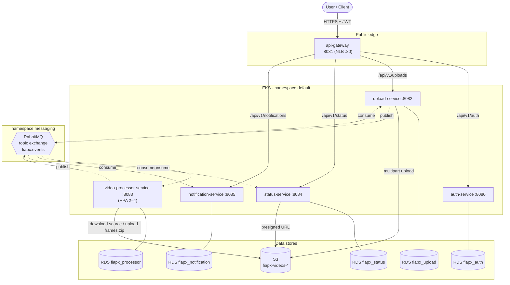
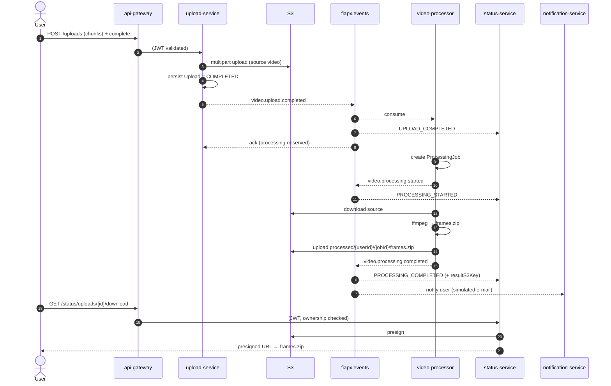
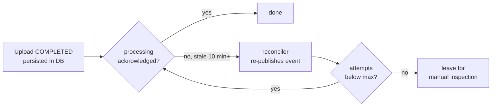
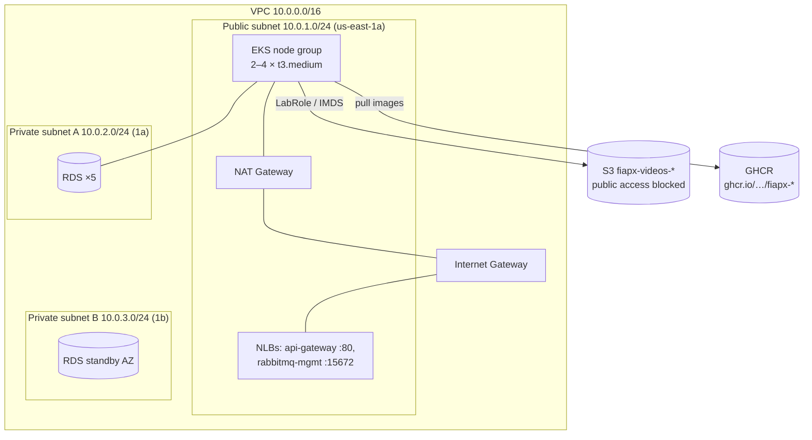
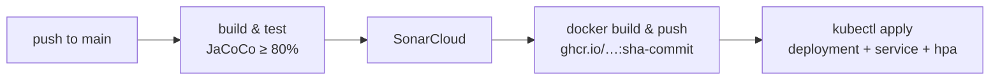

# FIAP X — Video Processing Platform · Architecture

Reference architecture for the FIAP X video processing system (Hackathon / Fase 5).
A user uploads a video, the system extracts its frames into a `.zip`, and the user
downloads the result. Processing is asynchronous, event-driven and horizontally
scalable.

This document is the single source of truth for the proposed architecture. Each
service repository links here.

- [Components & responsibilities](#components)
- [Runtime architecture](#runtime-architecture)
- [Event flow (choreographed saga)](#event-flow)
- [Reliability: how a request is never lost](#reliability)
- [Infrastructure (AWS / EKS)](#infrastructure)
- [CI/CD](#cicd)
- [Technology choices](#technology-choices)
- [Architecture decisions (ADRs)](#adrs)
- [Domain glossary](#glossary)

---

## Components & responsibilities

| Service | Port | Responsibility | Data store | Messaging |
|---|---|---|---|---|
| **api-gateway** | 8081 (NLB :80) | Single public entry point; routes to services; validates JWT | — | — |
| **auth-service** | 8080 | User registration/login; issues JWT (HS256, `sub`=userId, `email`, `role`) | RDS `fiapx_auth` | — |
| **upload-service** | 8082 | Chunked S3 multipart upload; publishes `video.upload.completed`; reconciliation safety net | RDS `fiapx_upload` + S3 | publishes + consumes |
| **video-processor-service** | 8083 | Consumes uploads, extracts frames with ffmpeg, writes result ZIP to S3 | RDS `fiapx_processor` + S3 | consumes + publishes |
| **status-service** | 8084 | Read model of each video's lifecycle; issues presigned download URLs | RDS `fiapx_status` + S3 | consumes |
| **notification-service** | 8085 | Notifies the user on completion/failure (simulated e-mail) | RDS `fiapx_notification` | consumes |

All services are Java 21 / Spring Boot 3.5, hexagonal architecture (ports & adapters),
Flyway migrations, JaCoCo ≥ 80% coverage gate, New Relic APM, and a shared messaging
library (`com.autoflow:rabbit-topic-lib`) over a single RabbitMQ topic exchange
`fiapx.events`.

---

## Runtime architecture

> The video-processor is **not** exposed through the gateway — it is purely
> event-driven (queue-consuming). Its REST endpoints (`/api/v1/jobs`) are internal
> (ClusterIP), used for inspection/tests only.

---

## Event flow (choreographed saga)

Single topic exchange `fiapx.events`. No orchestrator — each service reacts to the
events it cares about. Queue names are `<service>.<routing-key>`.

| Publisher | Routing key | Payload | Consumers |
|---|---|---|---|
| upload-service | `video.upload.completed` | uploadId, userId, filename, s3Key, mimeType | processor, status, **upload (ack)** |
| video-processor | `video.processing.started` | jobId, uploadId, userId, filename, status | status, upload (ack) |
| video-processor | `video.processing.completed` | + resultS3Key | status, notification, upload (ack) |
| video-processor | `video.processing.failed` | + errorMessage | status, notification, upload (ack) |

On failure (e.g. a corrupt video) the processor publishes `video.processing.failed`;
status records `PROCESSING_FAILED` and notification alerts the user.

---

## Reliability: how a request is never lost

> Requirement: *"Em caso de picos, o sistema não deve perder uma requisição."*

Three layers, because the RabbitMQ broker is **not durable** in this environment
(no persistent volume — see [ADR-0001](adr/0001-ephemeral-broker-application-durability.md)):

1. **Persist before publish.** The upload is written to S3 **and** PostgreSQL before
   `video.upload.completed` is published. The source of truth is the database, not the
   queue, so a lost message never means lost work.
2. **At-least-once processing.** The processor consumes and processes on the listener
   thread (not fire-and-forget), so the message is acknowledged **only after** the work
   completes. A pod crash mid-processing leaves the message unacknowledged → RabbitMQ
   redelivers it; after retries the shared library routes it to a per-queue dead-letter
   queue. Processing is **idempotent per `uploadId`** (unique in the DB), so redelivery
   never produces a duplicate result. See [ADR-0002](adr/0002-synchronous-idempotent-processing.md).
3. **Reconciliation safety net.** The upload-service observes `video.processing.*`
   events and stamps an acknowledgement on each upload. A scheduled reconciler
   re-publishes `video.upload.completed` for uploads that completed but were never
   acknowledged after a stale threshold (default 10 min), bounded by a max-attempts
   counter. This recovers work lost to a broker restart.

**Scalability.** The queue absorbs spikes; the processor scales on three axes —
listener consumers per pod (shared-lib `concurrent-consumers`), pods per node, and
pod count via a CPU-based **HorizontalPodAutoscaler** (2→4, backed by metrics-server).

---

## Infrastructure (AWS / EKS)

Provisioned by Terraform across two repos: **infra-k8s** (network, EKS, S3, RabbitMQ,
metrics-server) and **infra-db** (five RDS instances, reading infra-k8s remote state).

- **EKS** `fiapx-cluster` (v1.31), node group in the public subnet, IAM via the
  pre-existing **LabRole** (AWS Academy — no OIDC/IRSA, so no AWS Load Balancer
  Controller; NLBs are provisioned by the in-tree cloud controller).
- **metrics-server** in `kube-system` (enables HPA and `kubectl top`).
- **RDS** PostgreSQL 16, one database per service (`fiapx_auth|upload|processor|status|notification`).
- **S3** single bucket `fiapx-videos-<account_id>` for source videos and result ZIPs.
- **RabbitMQ** via Bitnami Helm chart in the `messaging` namespace (single replica,
  non-durable — see ADR-0001).
- Pods authenticate to S3 via the node's LabRole (IMDS); `S3_ENDPOINT` is empty in
  production so the AWS SDK targets real S3 (LocalStack is local-dev only).

---

## CI/CD

GitHub Actions per repo. Service pipeline: **build & test (JaCoCo ≥ 80%) → SonarCloud
→ build & push image to GHCR → deploy to EKS** (`kubectl apply`). Images are tagged
with the immutable commit SHA (`type=sha,format=long`) so deploys are reproducible and
rollback is possible. Infra repos run `terraform plan/apply`.

Secrets (JWT_SECRET, DB creds, RabbitMQ creds, S3 bucket, AWS session creds, New Relic
key) are injected as Kubernetes Secrets at deploy time from GitHub Actions secrets.

---

## Technology choices

| Concern | Choice | Notes |
|---|---|---|
| Containers/orchestration | Docker + Kubernetes (EKS) | — |
| Messaging | RabbitMQ (topic exchange) | choreographed saga |
| Database | PostgreSQL (RDS), one per service | database-per-service |
| Cache (Redis) | **not used** | no endpoint has read volume that justifies a cache; adding a component would only increase operational risk in the Academy environment. Revisit if status polling grows. |
| Monitoring | New Relic APM + `/actuator/prometheus` | New Relic agent optional (key via secret) |
| Notification | simulated e-mail (structured log + DB record) | requirement asks for "e-mail **ou outro meio**"; the flow is demonstrable end-to-end without external e-mail infrastructure |
| CI/CD | GitHub Actions → GHCR → EKS | — |

---

## Architecture decisions (ADRs)

- [ADR-0001 — Ephemeral broker with application-level durability](adr/0001-ephemeral-broker-application-durability.md)
- [ADR-0002 — Synchronous, idempotent video processing](adr/0002-synchronous-idempotent-processing.md)

---

## Domain glossary

- **Upload** — a user's video-send session (S3 multipart). Owns `userId`, original file,
  its own status; ends when the file is intact in S3. Emits `video.upload.completed`.
- **ProcessingJob** — the unit of work to extract frames from one video and produce the
  result ZIP. Created by the processor; identified by `jobId`, always tied to an `uploadId`.
- **JobStatus** — read-model projection of a video's lifecycle, maintained by the
  status-service from saga events. What the user lists.
- **Notification** — record + (simulated) delivery of a message to the user on job
  completion or failure.
- **Saga** — the choreographed event flow over `fiapx.events`, with no central orchestrator.
- **Result (frames ZIP)** — final artifact of a ProcessingJob, stored in S3 and
  downloaded via a presigned URL issued by the status-service.
